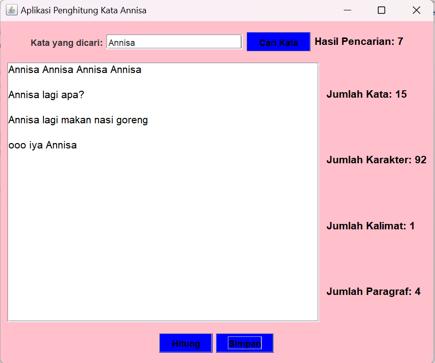

# PenghitungKata
 Tugas 5 - Annisa (2210010581)
 
# Aplikasi Penghitung Kata
 
Aplikasi Penghitung Kata adalah untuk menghitung kata yang diketik

# Keunggulan Aplikasi

- Penghitung Kata: Aplikasi ini memiliki penghitung kata, terdapat pencarian kata, jumlah karakter, jumlah kalimat, jumlah paragraf

# Pembuat Aplikasi
 Annisa - 2210010581 - Tugas 5 

# Fitur

Aplikasi ini menawarkan fitur:

Penghitungan kata
Perhitungan karakter
Perhitungan kalimat
Perhitungan paragraf

## Cara Menjalankan

1. Run File
2. Ketikkan kata di text area 
3. Ketikkan kata tersebut di text field
4. Tekan Button cari kata, maka akan keluar hasil

# Demo

